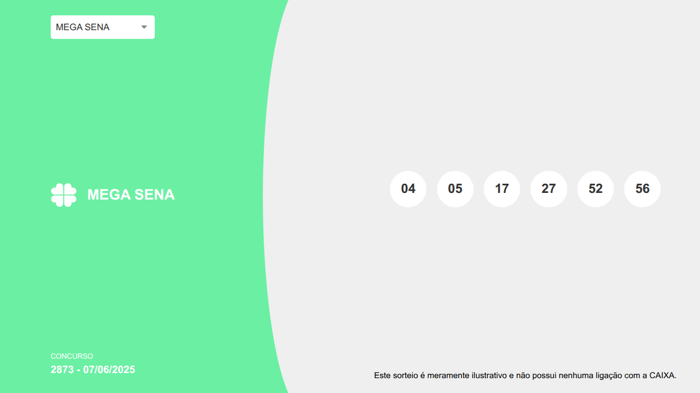
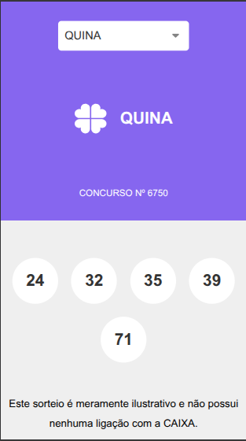

# 🎲 Loteria Resultados

Projeto em **React + TypeScript + Tailwind** que mostra os números do último sorteio das loterias brasileiras.

## ✅ Funcionalidades

- Seleção da loteria desejada
- Exibição dos últimos números sorteados
- Estilização com TailwindCSS
- **Layout responsivo** (funciona bem em celular e desktop)

## 🔧 Tecnologias

- React
- TypeScript
- TailwindCSS
- Vite
- API: [https://api.guidi.dev.br](https://api.guidi.dev.br)

## 🖼 Visualização

### Desktop  


### Mobile  


## ▶️ Como rodar

```bash
git clone https://github.com/Lui5Miranda/loterias.git
cd loterias
npm install
npm run dev
